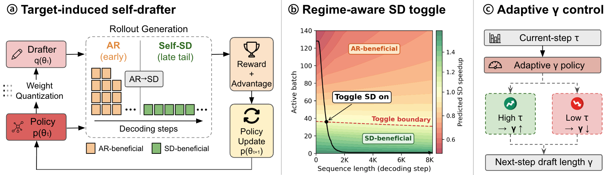

<div align="center">

# EfficientRollout: System-Aware Self-Speculative Decoding for RL Rollouts



[**Minseo Kim**](https://minseokim.org/)<sup>1</sup>\* · [**Minjae Lee**](https://mjbooo.github.io/)<sup>1</sup>\* · [**Seunghyuk Oh**](https://seunghyukoh.com/)<sup>1</sup> · [**Kevin Galim**](https://kevingalim.com/)<sup>1</sup> · [**Donghoon Kim**](https://scholar.google.co.kr/citations?hl=ko&user=FKPOG1EAAAAJ&hl=en)<sup>1</sup><br>
[**Coleman Hooper**](https://colemanhooper.org/)<sup>2</sup> · [**Harman Singh**](https://harmandotpy.github.io/)<sup>2</sup> · [**Amir Gholami**](https://amirgholami.org/)<sup>2</sup> · [**Hyung Il Koo**](https://scholar.google.com/citations?user=Oyy8aDMAAAAJ&hl=en)<sup>1</sup> · [**Wonjun Kang**](https://wonjunn.github.io/)<sup>1</sup>

<sup>1</sup>FuriosaAI &nbsp;&nbsp; <sup>2</sup>University of California, Berkeley

<sup>\*</sup>Equal contribution

[](https://arxiv.org/abs/2606.18967)

</div>

## 🔔 Updates

- **Jun 17, 2026** EfficientRollout is now on arXiv! 🎉

## 🔍 Overview

Reinforcement learning (RL) has become a representative post-training paradigm for large language models (LLMs), enabling strong reasoning and agentic capabilities. However, rollout generation remains a dominant latency bottleneck because autoregressive (AR) sampling decodes responses sequentially and a small number of long-tailed generations often determine completion time. Speculative decoding (SD) offers a natural way to address this bottleneck, as it is a well-established technique for serving fixed LLMs that reduces latency by rapidly drafting tokens and accepting them through parallel verification while preserving the target-model distribution. However, its practical speedups do not directly carry over to RL rollouts: (i) the evolving target policy makes any fixed drafter increasingly mismatched with the policy's output distribution; and (ii) active batch sizes shrink throughout rollout decoding, shifting decoding from compute-bound to memory-bound regimes where parallel verification can exploit underutilized compute. Therefore, accelerating RL rollouts requires both a drafter that remains effective under long, high-temperature generations from an evolving policy and system-aware use of SD that avoids compute-bound regimes. We present **EfficientRollout**, a system-aware self-SD framework designed to address this gap for RL rollouts. EfficientRollout induces a quantized drafter from the target model (*i.e.* self-speculative decoding), keeping it coupled to the evolving policy without separate drafter pretraining or online adaptation. It further coordinates a system-aware SD toggle policy with acceptance-aware draft-length adaptation, enabling speculation only in beneficial regimes while matching the drafting budget to evolving drafter quality. EfficientRollout reduces rollout and end-to-end latency by up to **19.6%** and **12.7%**, respectively, over an accelerated AR rollout baseline, while preserving final model quality.

## 🧱 Stack

| Component | Version | Notes |
|-----------|---------|-------|
| VeRL | v0.7.0 | RL training framework (this repo) |
| vLLM | 0.11.2 | Vendored in `third_party/vllm/`, editable |
| PyTorch | 2.9.0 | Required by vLLM 0.11.2 |
| Python | 3.10+ | |
| CUDA | 12.8 | |

**Target hardware:** 8×A100-SXM4-80GB (1 node)

## ⚙️ Setup

### 1. Create conda environment

```bash
conda create -n efficientrollout python=3.10 -y
conda activate efficientrollout
```

### 2. Install dependencies

```bash
# 1) PyTorch 2.9.0 for CUDA 12.8
pip install torch==2.9.0 --index-url https://download.pytorch.org/whl/cu128

# 2) Vendored vLLM (editable, builds C++/CUDA kernels)
bash scripts/install_vllm.sh

# 3) Flash Attention (prebuilt wheel)
pip install --no-deps "https://github.com/mjun0812/flash-attention-prebuild-wheels/releases/download/v0.9.0/flash_attn-2.8.3+cu128torch2.9-cp310-cp310-linux_x86_64.whl"

# 4) VeRL + remaining dependencies
pip install -e .
```

### 3. Prepare data

Download SimpleRL-Zoo datasets and convert to model-specific prompt formats.

```bash
# Download raw datasets
bash scripts/prepare_data_simplerl_8k_medium.sh  # MATH lv.1-4 (~8K, for LLaMA Instruct)
bash scripts/prepare_data_simplerl_8k_hard.sh    # MATH lv.3-5 (~8K, for Qwen)

# Convert to model-specific prompt format
python scripts/convert_data_for_model.py --model llama-instruct --data-dir data/simplerl-8k-medium
python scripts/convert_data_for_model.py --model qwen --data-dir data/simplerl-8k-hard
```

| Dataset | Difficulty | Model | Prompt Style |
|---------|-----------|-------|-------------|
| `simplerl-8k-medium-llama-instruct/` | Medium (MATH lv.1-4) | LLaMA-3.1-8B-Instruct | `\boxed{}` |
| `simplerl-8k-hard-qwen/` | Hard (MATH lv.3-5) | Qwen2.5-7B, Qwen2.5-14B | `\boxed{}` |

### 4. Calibrate SD toggle parameters (optional, for roofline-based toggle model)

Pre-calibrated A100 configs ship with the repo (`sd_toggle/configs/a100_tp1_*.json`). Re-calibrate only if moving to a different GPU or refitting.

```bash
# Measure F_eff (once per GPU type — A100 data already included)
python scripts/profiling/measure_gemm_effective_tflops.py --gpu 0

# Per-model sweep + fit (~25 min each, 5-GPU parallel)
bash scripts/calibrate_qwen_7b.sh         # → sd_toggle/configs/a100_tp1_qwen257b.json
bash scripts/calibrate_llama_instruct.sh  # → sd_toggle/configs/a100_tp1_llama318binstruct.json
bash scripts/calibrate_qwen_14b.sh        # → sd_toggle/configs/a100_tp1_qwen2514b.json
```

See [`sd_toggle/README.md`](sd_toggle/README.md) for details on the roofline model and CLI reference.

### 5. RL Training with EfficientRollout

#### SD modes

| Mode | Flag | Description |
|------|------|-------------|
| `no-sd` | — | AR-only baseline |
| `rtn` | `spec_method=quant_self` | SD always-on with RTN W4 drafter (fixed γ) |
| `toggle` | `spec_method=quant_self` + `spec_sd_toggle_mode=roofline` | + roofline regime-aware SD toggle (fixed γ) |
| `adaptive` | `toggle` flags + `spec_gamma_ladder=5,7,9,11` | + adaptive-γ ladder — **full EfficientRollout** |

#### Qwen2.5-7B

```bash
bash scripts/run_qwen2.5_7b_sd.sh no-sd       # AR baseline
bash scripts/run_qwen2.5_7b_sd.sh rtn         # Quantized self-SD, fixed γ=7
bash scripts/run_qwen2.5_7b_sd.sh toggle      # + roofline toggle, fixed γ=7
bash scripts/run_qwen2.5_7b_sd.sh adaptive    # full EfficientRollout (toggle + adaptive γ)
```

#### LLaMA-3.1-8B-Instruct

```bash
bash scripts/run_llama3.1_8b_instruct_sd.sh no-sd       # AR baseline
bash scripts/run_llama3.1_8b_instruct_sd.sh rtn         # Quantized self-SD, fixed γ=5
bash scripts/run_llama3.1_8b_instruct_sd.sh toggle      # + roofline toggle, fixed γ=5
bash scripts/run_llama3.1_8b_instruct_sd.sh adaptive    # full EfficientRollout (toggle + adaptive γ)
```

#### Qwen2.5-14B

```bash
bash scripts/run_qwen2.5_14b_sd.sh no-sd       # AR baseline
bash scripts/run_qwen2.5_14b_sd.sh rtn         # Quantized self-SD, fixed γ=5
bash scripts/run_qwen2.5_14b_sd.sh toggle      # + roofline toggle, fixed γ=5
bash scripts/run_qwen2.5_14b_sd.sh adaptive    # full EfficientRollout (toggle + adaptive γ)
```

## 🙏 Acknowledgments

EfficientRollout is built on these excellent open-source projects — we thank their authors and communities:

- [veRL](https://github.com/volcengine/verl)
- [vLLM](https://github.com/vllm-project/vllm)
- [SimpleRL-Zoo](https://github.com/hkust-nlp/simpleRL-reason)

## 📝 Citation

If you find EfficientRollout useful, please consider citing:

```bibtex
@article{kim2026efficientrollout,
  title={EfficientRollout: System-Aware Self-Speculative Decoding for RL Rollouts},
  author={Kim, Minseo and Lee, Minjae and Oh, Seunghyuk and Galim, Kevin and Kim, Donghoon and Hooper, Coleman and Singh, Harman and Gholami, Amir and Koo, Hyung Il and Kang, Wonjun},
  journal={arXiv preprint arXiv:2606.18967},
  year={2026}
}
```
